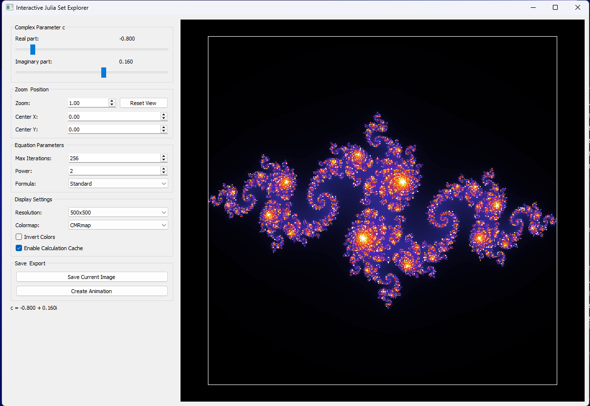

# Julia Set Explorer

Python fractal generator based on the Julia set with both command-line and graphical user interfaces.

## Overview

This project provides tools to generate, explore, and animate beautiful Julia set fractals. It features:

- High-performance calculation using Numba JIT compilation
- Interactive GUI for real-time parameter adjustments
- Command-line interface for batch processing
- Support for creating high-resolution images
- Animation capabilities for creating GIFs

## How It Works

The Julia set is a fractal named after the French mathematician Gaston Julia. For each point (x,y) in the complex plane, the algorithm applies the formula z = z² + c repeatedly, where c is a complex constant. The number of iterations before z "escapes" (exceeds a certain value) determines the color of each pixel.

### Command-Line Interface

The `julia.py` file can be executed from a terminal to generate Julia set images with various parameters:


### GUI Interface

The project now features a full graphical interface (`julia_ui.py`) that allows for interactive exploration:

- Real-time updates when changing parameters
- Zoom and pan functionality
- Adjustable resolution, iterations, and colormaps
- Option to save images or create animations
- Calculation caching for improved performance



## Examples

### Different Resolutions

The same Julia set (c = -0.8 + 0.16j) at different resolutions:

Low resolution (100x100):


High resolution (2000x2000):


### Animations

The generator can create two types of animated GIFs:

1. **Zoom Animation**: Progressively zooms into a part of the fractal


2. **Parameter Animation**: Shows how changes to the complex constant c affect the fractal


## Installation

1. Clone this repository:
```
git clone https://github.com/Aatrick/Julia_Set.git
```

2. Install the required dependencies:
```
pip install -r requirements.txt
```

## Usage

### Command-Line Interface
```
python julia.py
```

### Graphical Interface
```
python julia_ui.py
```
Or run the provided batch file:
```
run_julia_ui.bat
```

## Performance Notes

- The implementation uses Numba for significant performance acceleration
- Calculations are cached to improve responsiveness when exploring
- Multi-core processing is utilized for maximum performance
